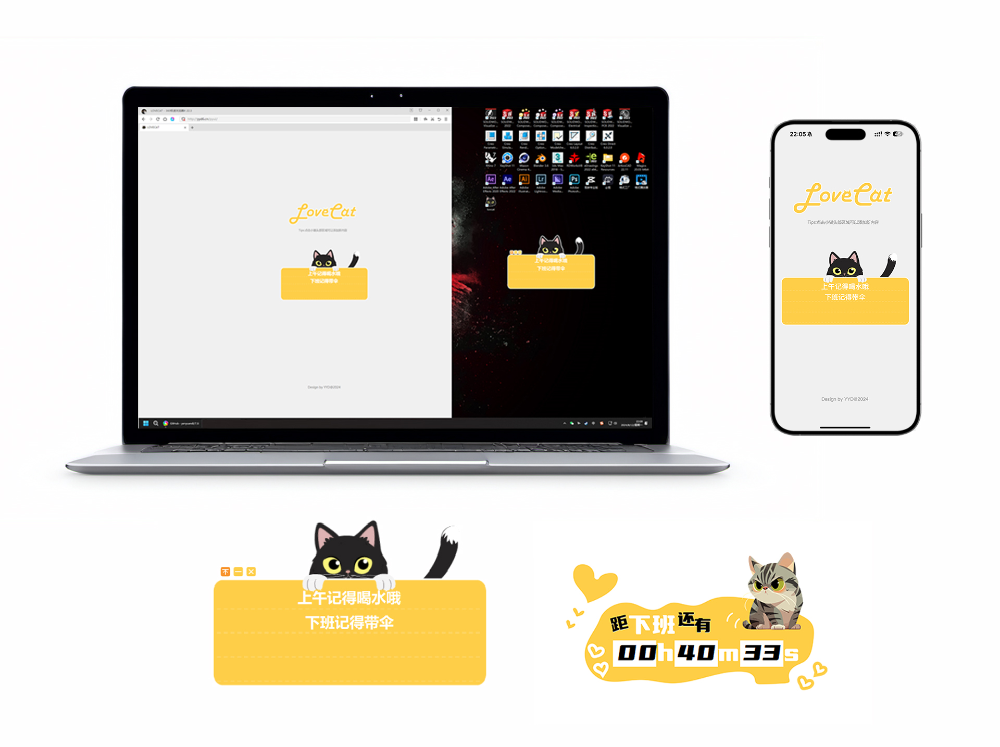

## 一款桌面窗口化情侣互动小组件-留言，情话，待办



### 项目简介
这是一款使用python的pyqt5写的桌面小组件，同时也有网页端，都部署好后，运行桌面端后组件可以随意拖动，并设置是否置顶，网页端可以远程添加一些留言或者情话或者待办之类的，适合小情侣工作之余的互动、一些重要事件的待办提醒，工程文件中附带一个下班倒计时桌面组件。详细的使用演示请移步B站观看视频演示。<br>
- **B站视频演示地址：[点击观看视频](https://www.bilibili.com/video/BV1Fo4y137n9/?vd_source=a935ffb91a0eac4e16a0461b0709faa9)**<br>
- <a target="_blank" href="https://qm.qq.com/cgi-bin/qm/qr?k=6BoHiLag0xPQg3HIsp3a0Npq78tsKBgo&jump_from=webapi&authKey=MgBcDW4xIjAaBO7dsaLoOuYKvtvu5cDCu1uN/BXexjPXmqTng2u18WuBM1G5RN5/"></a>QQ交流群：979103710

### 需要的环境
* ### python 3.10.5 <br>

    **pyqt5**<br>
    ``` 
    pip install pyqt5
    ```
    **requests** <br>
    ```
    pip install requests 
    ```

* ### 一个虚拟主机
    ```
    部署好Nginx，MySQL，php7.4.33
    ```
* ### 一个域名解析到服务器ip


### 代码文件树注释

```
┌─tree.txt-----------------------------------文件树说明
│  
├─AE AI-----------------------------------☆素材相关
│  ├─AE
│  │      小猫动效制作.aep--------------------小猫动图的AE工程文件
│  │      
│  └─AI
│          小黑猫动图制作.ai------------------小猫动图的AI分层文件矢量图
│          小黑猫顶部logo.ai------------------顶部LOGO的AI文件
│          
├─html------------------------------------☆前后端相关
│  │  sql.txt--------------------------------数据库写入命令
│  │  
│  ├─LoveCat(htnl+php)--------------------☆前端后端代码
│  │      cat.png----------------------------备用图，暂时没用
│  │      catbig.png-------------------------网页页面小猫背景图
│  │      favicon.ico------------------------网页图标文件
│  │      ico.png----------------------------手机添加主屏幕使用的图标文件
│  │      index.php--------------------------网页主程序
│  │      logo.png---------------------------顶部logo图片	
│  │      styles.css-------------------------网页样式
│  │      update_text.php--------------------后端处理php文件
│  │      
│  └─LoveCatjson--------------------------☆python获取事件使用的json文件				
│          db.php----------------------------链接数据库
│          pyui.php--------------------------json文件，访问后得到json
│
├─jpg-------------------------------------☆github图片调用
│        
└─python----------------------------------☆python程序
    ├─LoveCat-----------------------------☆小猫桌面互动小组件
    │  │  close.png--------------------------关闭按钮图标
    │  │  favicon.ico------------------------备用
    │  │  hide.png---------------------------隐藏按钮图标
    │  │  ico.png----------------------------任务栏ico显示调用
    │  │  lovecat.pyw------------------------python主程序
    │  │  top.png----------------------------置顶按钮图标
    │  │  topdone.png------------------------置顶按钮按下图标
    │  │  
    │  └─01-------------------------------☆小猫动图图片序列文件夹
    │          
    └─下班倒计时---------------------------☆下班倒计时程序
        │  1.png-----------------------------备用，静态背景图
        │  1.TTF-----------------------------文字字体文件
        │  ico.png---------------------------任务栏ico显示调用
        │  下班.pyw---------------------------python主程序
        │  
        └─03------------------------------☆小猫动图图片序列文件夹
``` 

### 代码需要替换的部分

* index.php 替换顶部为自己的数据库地址、账号、密码  替换第35行自己ico.png存放地址  

* update_text.php 替换顶部为自己的数据库地址、账号、密码  

* db.php 替换顶部为自己的数据库地址、账号、密码  

* lovecat.pyw 替换195行为自己的pyui.php存放地址  

* 下班.pyw 第13行修改自己的实际下班时间  


### 代码功能简介
* 桌面端：python代码部署完毕后，可以双击pyw文件打开程序，桌面会出现一个小组件，鼠标可以随意移动，左上角有置顶按钮、最小化按钮、关闭按钮，程序每十秒钟获取一次数据

* 网页端：前后端代码部署完毕后，打开自己的域名，会访问到一个页面，这个页面可以添加、删除、修改每条事件，点击LOGO部分会刷新当前页面，点击小猫头部区域可以添加新事件，每条事件可输入内容做了限制，防止超出显示，并且限制了只能添加四条事件

* 手机端（IOS）：前端代码为手机做了适配，使用Safari打开页面后点开底部分享按钮-添加到主屏幕-设置名称后，可以在桌面显示一个图标，打开后可以模拟成一个app，去掉了Safari的导航栏，并且页面限制了上下滚动，使用方式跟网页端一样  

### 已知bug
* 暂无 

### 🌟制作不易，感谢支持🌟
